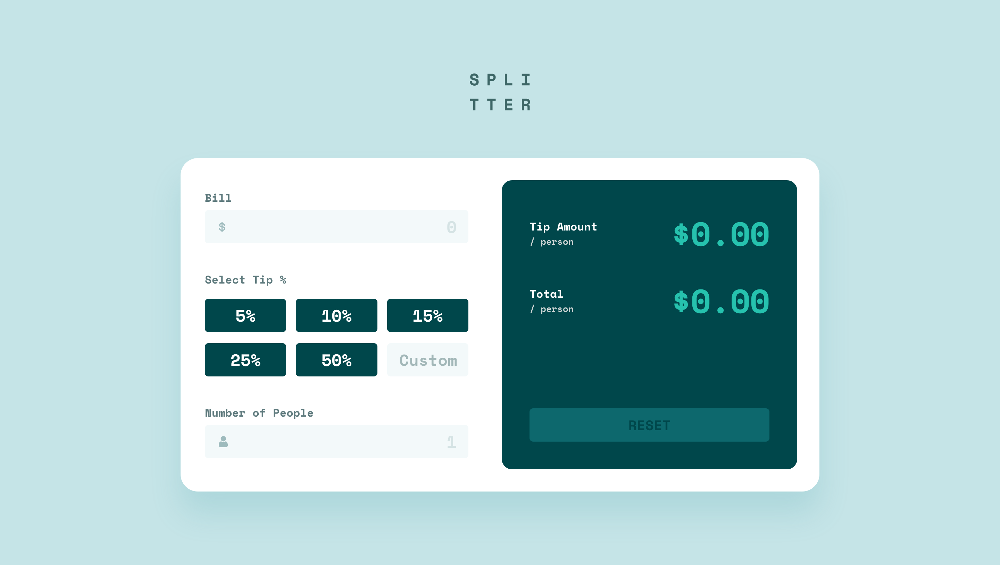

# Frontend Mentor - Tip calculator app solution

This is a solution to the [Tip calculator app challenge on Frontend Mentor](https://www.frontendmentor.io/challenges/tip-calculator-app-ugJNGbJUX). Frontend Mentor challenges help you improve your coding skills by building realistic projects.

## Table of contents

- [Overview](#overview)
  - [The challenge](#the-challenge)
  - [Screenshot](#screenshot)
  - [Links](#links)
- [My process](#my-process)
  - [Built with](#built-with)
  - [What I learned](#what-i-learned)
  - [Continued development](#continued-development)
  - [Useful resources](#useful-resources)
- [Author](#author)

**Note: Delete this note and update the table of contents based on what sections you keep.**

## Overview

### The challenge

Users should be able to:

- View the optimal layout for the app depending on their device's screen size
- See hover states for all interactive elements on the page
- Calculate the correct tip and total cost of the bill per person

### Screenshot



### Links

- Live Site URL: [](https://erickson-tip-calculator-app.netlify.app/)

## My process

### Built with

- Semantic HTML5 markup
- CSS3
- Flexbox
- CSS Grid
- [Open Graph](https://ogp.me/) - Internet protocol to standardize the use of metadata within a webpage to represent the content of a page
- [React](https://react.dev/) - JS library
- [Vite](https://vitejs.dev/) - Build tool

### What I learned

- Implementing my first React hook: useState
- The technique of lifting state up for the purpose of sharing state across components
- Using Open Graph to provide rich previews when the website URL is shared on social networks
- The ```inputMode``` attribute that allows a browser to display an appropriate virtual keyboard.
- Deeper understand and importance of accessibility
    • Some key accessibility features in this project are:
    1. Being able to navigate the app with just a keyboard
    2. Using ```visuallyhidden``` for decorative icons to so screen readers can skip them
    3. Sufficient color contrast 


Before I began this project, I didn't expect to learn so many things. From important React concepts, implementing Open Graph for rich previews on social networks, and making the app more accessible, some personal experience points were definitely gained thanks to this project.


### Continued development

Use this section to outline areas that you want to continue focusing on in future projects. These could be concepts you're still not completely comfortable with or techniques you found useful that you want to refine and perfect.

**Note: Delete this note and the content within this section and replace with your own plans for continued development.**

### Useful resources

- [Example resource 1](https://dequeuniversity.com/rules/axe/4.6/color-contrast) - This helped me for XYZ reason. I really liked this pattern and will use it going forward.
- [Example resource 2](https://www.example.com) - This is an amazing article which helped me finally understand XYZ. I'd recommend it to anyone still learning this concept.

**Note: Delete this note and replace the list above with resources that helped you during the challenge. These could come in handy for anyone viewing your solution or for yourself when you look back on this project in the future.**

## Author

- Website - [Zowie Erickson](https://github.com/zowieerickson)
- Frontend Mentor - [@zowieerickson](https://www.frontendmentor.io/profile/zowieerickson)
- Twitter - [@ZowieErickson](https://www.twitter.com/ZowieErickson)
